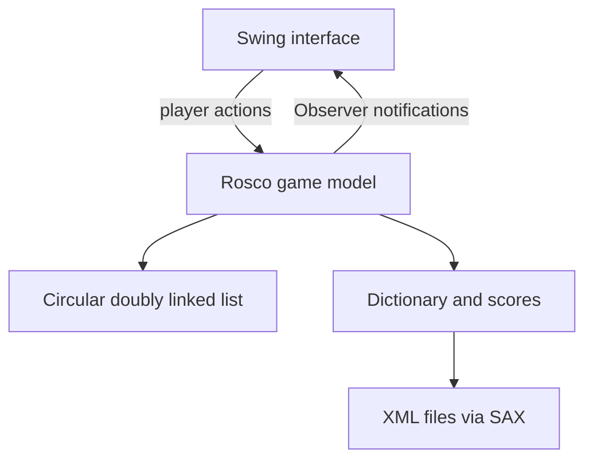

# Pasapalabra

[](https://www.java.com/)
[](https://docs.oracle.com/javase/tutorial/uiswing/)
[](#academic-context)

A desktop word game developed collaboratively by [Mikel Barcina](https://github.com/mbarcina001) and [Jose Ángel Gumiel](https://github.com/jagumiel) as the final project for a **Software Engineering** course.

Inspired by the final round of the Spanish television game show *Pasapalabra*, the application challenges one player to solve a timed sequence of definitions - one for each of the 27 letters in the Spanish alphabet. The player can answer or pass, revisit unanswered questions, accumulate points, and save a result in a persistent top-ten ranking.

> [!NOTE]
> This is a historical academic project originally developed in 2014 with Java 7 and Eclipse. The repository preserves the original implementation and documentation; see [Compatibility and current limitations](#compatibility-and-current-limitations) before trying to build it on a modern system.

## Project highlights

- Timed, single-player 27-letter quiz.
- Random question selection from an XML dictionary.
- Answer, pass, correct-answer and incorrect-answer game states.
- Support for definitions with one or several accepted terms.
- Score calculation based on correct answers, mistakes and remaining time.
- Persistent top-ten ranking stored in XML.
- Optional sound feedback for correct and incorrect answers.
- Swing interface with a dynamically arranged circular letter board.
- Object-oriented design with Observer, Singleton-style shared instances, inheritance and polymorphism.
- Purpose-built circular doubly linked list for traversing and removing completed questions.

## Game flow

1. Enter a player name and choose whether sound is enabled.
2. The game loads one random definition for each letter.
3. Answer the current question or pass it for a later round.
4. The board updates each letter according to its state:
   - blue: unanswered;
   - yellow: current question;
   - green: correct;
   - red: incorrect.
5. The game ends when every question has been answered or the 250-second timer expires.
6. The score is calculated and, when applicable, added to the XML-backed top-ten table.

## Architecture



The code is separated into two principal packages:

- `packInterfaz` contains the Swing windows, controls and visual representation of the letter board.
- `packPasaPalabra` contains the game model, player, timer, dictionary, score management, XML readers and custom data structures.

## Software-engineering decisions

| Concern | Implementation | Purpose |
| --- | --- | --- |
| Game-state propagation | `Rosco` extends `Observable`; `InterfazRosco2` implements `Observer` | Refreshes the question, timer, score and coloured letter indicators after a player action. |
| Shared game services | Private constructors and static accessors in classes such as `Rosco`, `Jugador` and `Diccionario` | Maintains one shared instance of each central game object. |
| Question traversal | Custom `DoubleLinkedList` composed of `Nodo` objects | Models the circular board and removes completed questions from subsequent rounds. |
| Fast dictionary lookup | `HashMap<Character, ListaDefiniciones>` | Groups questions by initial letter before selecting one at random. |
| Multiple valid answers | Abstract `Definicion` with `DefinicionUnTermino` and `DefinicionVariosTerminos` subclasses | Applies inheritance and polymorphism without allocating a list for every single-answer question. |
| Persistent data | SAX parsers for `DICCIONARIO.XML` and `puntuaciones.xml` | Loads the question bank and preserves the top-ten ranking between sessions. |
| Circular layout | Trigonometric positioning of Swing labels | Distributes the 27 letter indicators around the game board. |

## Repository structure

```text
.
├── src/
│   ├── packInterfaz/        # Swing user interface
│   ├── packPasaPalabra/     # Game model and data structures
│   └── packIconos/          # Letter-state images and UI assets
├── res/
│   ├── DICCIONARIO.XML      # Questions and accepted answers
│   └── puntuaciones.xml     # Persistent high-score table
├── sounds/                  # Correct and incorrect answer feedback
├── bin/                     # Historical Eclipse build output
├── forms-1.3.0.jar          # Bundled legacy UI dependency
└── Documentacion-Memoria.pdf
```

## Running the original project

The most faithful reproduction environment is **Eclipse with JDK 7 or 8 on Windows**. The checked-in Eclipse configuration targets Java 7, and the compiled classes under `bin/` use Java class-file version 51.

1. Clone the repository:

   ```bash
   git clone https://github.com/jagumiel/Pasapalabra.git
   cd Pasapalabra
   ```

2. In Eclipse, select **File -> Import -> Existing Projects into Workspace** and choose the repository directory.
3. Configure a Java 7- or Java 8-compatible JDK for the project.
4. Preserve the original source encoding as **ISO-8859-1** unless the sources and accented filenames are converted together to UTF-8.
5. Run `packInterfaz.Principal` as a Java application from the repository root.

The bundled `.classpath` already references `forms-1.3.0.jar` and uses `bin/` as the Eclipse output directory.

## Documentation

The complete project report is available in Spanish:

- [Software Engineering project report (PDF)](Documentacion-Memoria.pdf)

It describes the requirements, class responsibilities, design evolution, Observer implementation, custom data structures, XML persistence and original user-interface screenshots.

## Compatibility and current limitations

This repository documents and preserves the original course submission. It has not yet been modernised for current Java releases:

- The project targets Java 7 and has no Maven or Gradle build.
- Source files use ISO-8859-1 rather than UTF-8.
- XML paths use Windows separators such as `res\puntuaciones.xml`; they do not work unchanged on Linux or macOS.
- Audio playback relies on the internal `sun.audio` API, which is not a supported public Java API and is unavailable on current JDKs.
- `java.util.Observable` and `Observer` were deprecated in Java 9.
- The repository contains Eclipse-generated classes and duplicated resources under `bin/`.
- There are no automated tests or continuous-integration checks.
- No repository-wide software licence has been added yet.

These limitations make the repository best suited as an educational record of object-oriented design and team-based software development. They also define a clear modernisation path.

## Suggested modernisation roadmap

- [ ] Add Maven or Gradle and declare dependencies explicitly.
- [ ] Convert source code and resource names to UTF-8.
- [ ] Replace hard-coded paths with `Path`, `Paths` or classpath resources.
- [ ] Replace `sun.audio` with `javax.sound.sampled`.
- [ ] Replace the deprecated Observer API with listeners, property-change events or another explicit event mechanism.
- [ ] Add unit tests for scoring, question selection, accepted answers and circular-list behaviour.
- [ ] Add integration tests for XML loading and score persistence.
- [ ] Remove generated files from version control and publish runnable builds as GitHub Releases.
- [ ] Add a licence agreed by both authors.

## Academic context

The project combines material from software engineering, object-oriented programming, algorithms and data structures, and graphical user-interface development. Its design was iterated through class and sequence diagrams before implementation, and later extended to incorporate the Observer pattern and multiple accepted answers.

This was a **collaborative project** authored by:

- [Mikel Barcina](https://github.com/mbarcina001)
- [Jose Ángel Gumiel](https://github.com/jagumiel)

The report and repository should therefore be cited and presented as joint work.

## Disclaimer

This is an unofficial educational project. It is not affiliated with or endorsed by the television programme or its rights holders.

## Licence

No licence file is currently included. Unless a licence is added by the authors, the source code should not be assumed to be available for reuse or redistribution.
